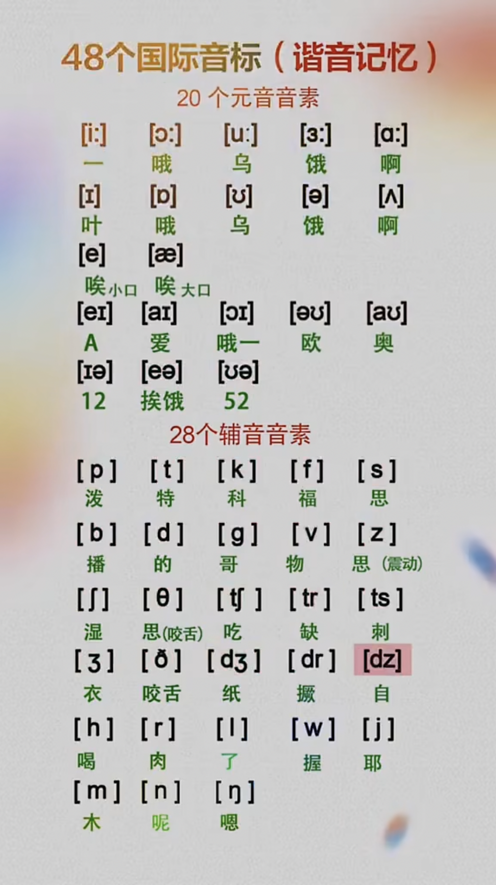

5个长元音： [i:] [ə:] [ɔ:] [u:] [ɑ:]

7个个短元音： [i] [ə] [ɒ] [u] [Λ] [æ] [e]

双元音: [ai] [ei] [ɔi] [au] [əu] [iə] [eə] [uə]

清辅音：[p] [t] [k] [f] [θ] [s] [∫] [tr] [ts] [t∫]

浊辅音：[b] [d] [g] [v] [ð] [z] [ʒ] [dr] [dz] [dʒ]

其他符音：[h] [m] [n] [ŋ] [l] [r] [w] [j]

l不在单词的开头发“哦”   

